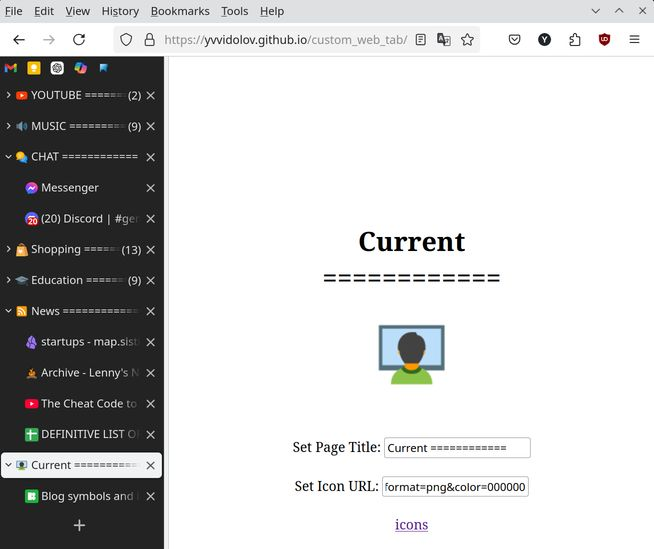

### Description
Load this webpage and choose its `Title` and `Icon`.  
Useful for vertical style tabs in web browsers.  
Use this to divide or group tabs.

### Usage
- Open Link:
[https://yvvidolov.github.io/custom_web_tab/](https://yvvidolov.github.io/custom_web_tab/)
- Set Title, press \<Enter\>
- Click `icons` to go to `icons8.com`
  - Search for app/icon
  - Click on chosen icon
  - Press 'Copy' -> 'Link to PNG'
- Set `Icon URL` to copied URL
- ...
- Profit

### Example Setup
[example.txt](example.txt)

### Screenshot
Firefox with TreeStyleTabs

